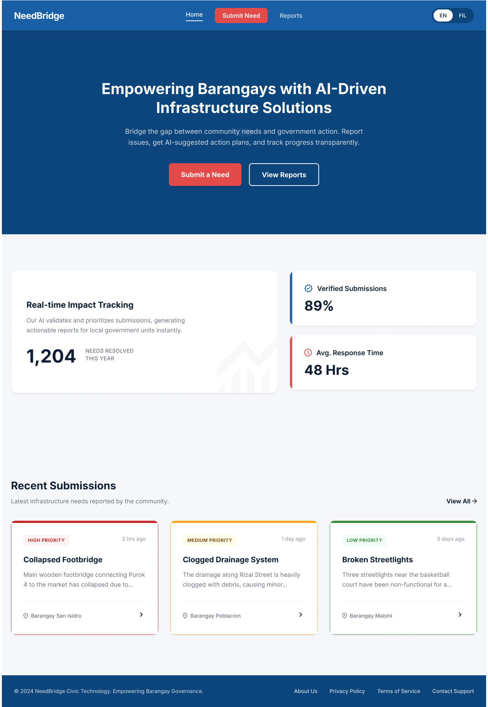
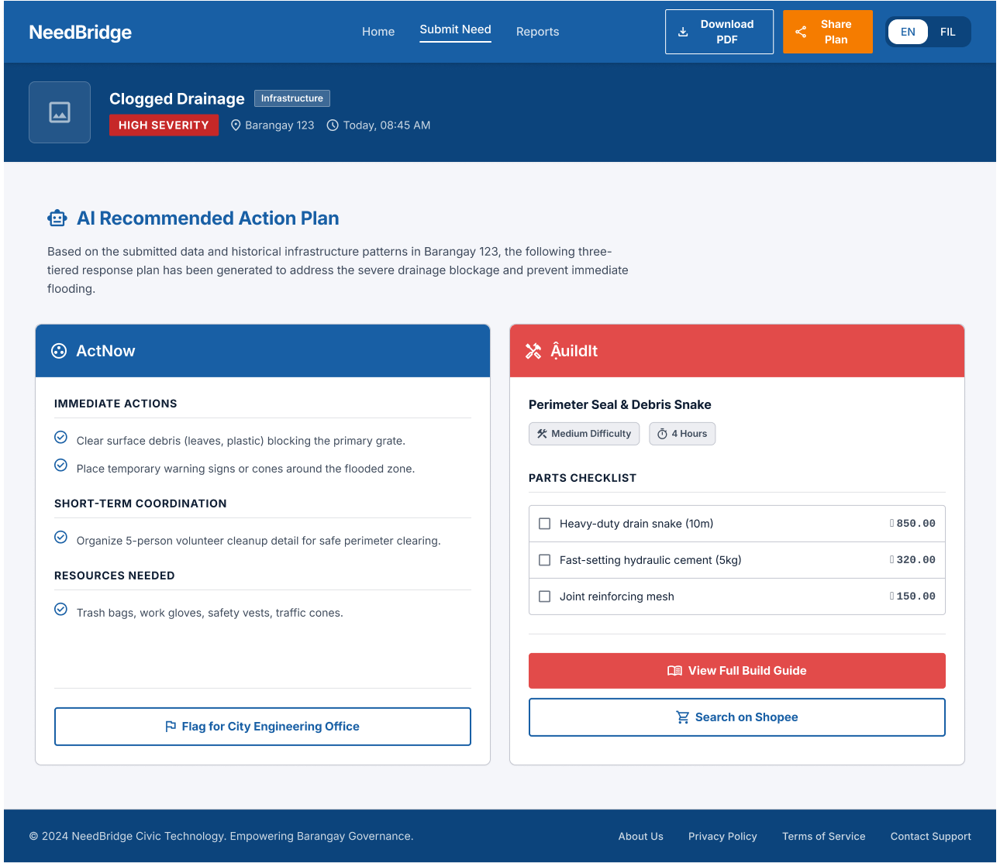

# NeedBridge 🌉

> **Empowering Barangays with AI-Driven Infrastructure Solutions**

NeedBridge is a civic tech web platform that bridges the gap between community-reported infrastructure problems and actionable solutions. Residents and barangay officials submit an issue via photo upload or text description — NeedBridge's AI pipeline instantly generates two parallel response tracks: an **ActNow** coordination plan for community leaders, and a **BuildIt** DIY technical guide for engineering student volunteers.

Built for **Create & Conquer 2026** — FEU Institute of Technology Computer Engineering Organization Hackathon.

---

## 🏆 Hackathon

| | |
|---|---|
| **Competition** | Create & Conquer 2026 |
| **Organizer** | FEU Institute of Technology — Computer Engineering Organization |
| **Themes** | Maker Cart × IBM Social AI |
| **Team** | Team NeedBridge |

---

## 👥 Team Members

| Name | Role |
|---|---|
| **Miguel Mansilla** | Team Leader & Sole Developer — UI Design, Frontend Development & AI Integration |
| **Juan Montenegro** | System Design — User Flow Diagram & AI Model Diagram |
| **Jiovan Abulencia** | Research & Documentation — Project Brief |
| **Lance Relova** | Research & Documentation — Project Brief  |

---

## 🚨 The Problem

In underserved and disaster-affected communities across the Philippines, infrastructure problems — broken water pumps, flooded drainage, damaged roads — are widely reported but slowly resolved. The gap isn't always funding or willingness. It's the absence of a fast, accessible bridge between knowing what's broken and knowing exactly what to do about it.

Existing tools identify needs. NeedBridge generates the response.

---

## 💡 The Solution

NeedBridge accepts a photo upload and/or text description of any community infrastructure issue. In seconds, it produces:

### Track 1 — ActNow 🟢
**For:** Barangay officials, NGO coordinators, community leaders

Generates an immediate action protocol executable with zero to minimal resources — assignments, coordination steps, resources needed, and the correct government agency to escalate to (DPWH, MWSS, NDRRMC).

### Track 2 — BuildIt 🟠
**For:** Engineering students, makers, DRRM-trained youth, technical volunteers

Generates a DIY technical solution with a component list, estimated cost in Philippine Peso, build guide steps, and Shopee/Lazada sourcing references — giving engineering students a structured brief to apply their skills to real community problems.

---

## 🗺️ User Flow Diagram


## 🤖 AI Model Diagram


## 📸 Screenshots



--

## ✨ Key Features

- **Photo-to-Analysis Pipeline** — Upload a photo of any infrastructure issue; AI identifies the type, cause, and severity automatically
- **Dual-Track AI Output** — ActNow and BuildIt cards generated simultaneously from a single submission
- **Severity Classification** — High / Medium / Low priority tagging with color-coded visual indicators
- **Flag for Escalation** — Generates a pre-filled email template addressed to the correct government agency
- **Coordinator Dashboard** — Login-protected view for barangay officials to manage and track all submissions
- **Community Reports** — Public-facing feed of verified infrastructure submissions within a barangay
- **Pattern Detection** — Alerts coordinators when multiple similar issues are reported in the same area
- **EN / FIL Language Toggle** — Full interface available in English and Filipino
- **Real-time AI Hint** — Live issue classification appears as the user types their description

---

## 🛠️ Tech Stack

| Layer | Technology |
|---|---|
| **Frontend & App Builder** | Lovable & Bolt (React + Tailwind CSS) |
| **AI — Vision & Generation** | Open Router AI |
| **AI — Classification** | IBM Watsonx (issue type classification, severity routing) |
| **API Routes** | Next.js API Routes (`/api/analyze`) |
| **Deployment** | Vercel |
| **Version Control** | GitHub |

---

## 🏗️ Project Structure

```
NeedBridge_C-C/
├── app/
│   ├── api/
│   │   └── analyze/
│   │       └── route.ts        # Claude API integration endpoint
│   ├── page.tsx                # Homepage — Submission Portal
│   ├── result/
│   │   └── page.tsx            # Result Screen — ActNow + BuildIt cards
│   ├── dashboard/
│   │   └── page.tsx            # Coordinator Dashboard
│   └── reports/
│       └── page.tsx            # Community Reports (Public)
├── components/
│   ├── ActNowCard.tsx          # Green dual-output card
│   ├── BuildItCard.tsx         # Amber dual-output card
│   ├── LoadingScreen.tsx       # AI processing animation
│   ├── SubmissionForm.tsx      # Photo upload + text input form
│   ├── CoordinatorDashboard.tsx
│   └── LanguageToggle.tsx      # EN / FIL switcher
├── lib/
│   └── i18n.ts                 # Language string constants (EN + FIL)
├── public/
├── .env.local                  # API keys (not committed)
├── .gitignore
└── README.md
```

---

## 🚀 Getting Started

### Prerequisites
- Node.js 18+
- A Claude API key from [console.anthropic.com](https://console.anthropic.com)

### Installation

**1. Clone the repository**
```bash
git clone https://github.com/YOUR_USERNAME/NeedBridge_C-C.git
cd NeedBridge_C-C
```

**2. Install dependencies**
```bash
npm install
```

**3. Set up environment variables**

Create a `.env.local` file in the project root:
```
ANTHROPIC_API_KEY=your_claude_api_key_here
```

> ⚠️ Never commit your `.env.local` file. It is already listed in `.gitignore`.

**4. Run the development server**
```bash
npm run dev
```

Open [http://localhost:3000](http://localhost:3000) in your browser.

---

## 🔌 API Reference

### `POST /api/analyze`

Accepts a photo and/or text description of a community infrastructure issue and returns a structured dual-track AI response.

**Request body:**
```json
{
  "imageBase64": "string (base64-encoded image, optional)",
  "imageMediaType": "image/jpeg | image/png",
  "description": "string (text description of the issue, optional)",
  "category": "Infrastructure | Water | Safety | Other (optional)"
}
```

**Response:**
```json
{
  "success": true,
  "data": {
    "issueType": "Drainage Overflow",
    "severity": "High",
    "isDIYFeasible": true,
    "barangayContext": "string",
    "actNow": {
      "immediateActions": ["string"],
      "shortTermCoordination": ["string"],
      "resourcesNeeded": ["string"],
      "escalationAgency": "DPWH | MWSS | NDRRMC | Barangay Council"
    },
    "buildIt": {
      "solutionTitle": "string",
      "difficulty": "Beginner | Intermediate | Advanced",
      "estimatedTime": "string",
      "parts": [
        { "name": "string", "price": "₱XXX" }
      ],
      "buildSteps": ["string"]
    }
  }
}
```

---

## 🎨 Design System

| Token | Color | Hex |
|---|---|---|
| Primary (Nav, Headers) | Deep Civic Blue | `#1A3C5E` |
| ActNow Accent | Action Green | `#2E7D32` |
| BuildIt Accent | Maker Amber | `#F57C00` |
| Gov Escalation Accent | Slate Blue | `#37474F` |
| Severity — High | Alert Red | `#C62828` |
| Severity — Medium | Caution Yellow | `#F9A825` |
| Severity — Low | Clear Green | `#388E3C` |
| Page Background | Off-White | `#F5F6FA` |
| Card Background | White | `#FFFFFF` |

**Font:** Inter / Nunito (Google Fonts)

---

## 📱 Screens

| Screen | Description |
|---|---|
| **Homepage / Submission Portal** | Photo upload + text description form with real-time AI hint |
| **Loading Screen** | Step-by-step AI processing animation (Watsonx → Claude) |
| **Result Screen** | Dual ActNow + BuildIt output cards with Flag for Escalation |
| **Coordinator Dashboard** | Login-protected submission management with pattern detection |
| **Community Reports** | Public feed of all verified barangay submissions |

---

## 🌐 Deployment

NeedBridge is deployed on Vercel.

**To deploy your own instance:**

1. Push your code to GitHub
2. Go to [vercel.com](https://vercel.com) and import the repository
3. Under **Environment Variables**, add:
   ```
   ANTHROPIC_API_KEY = your_claude_api_key_here
   ```
4. Click **Deploy**

---

## 📋 Prototype Status

| Feature | Status |
|---|---|
| Homepage / Submission Portal | 🟡 In Progress |
| Photo upload + base64 conversion | 🟡 In Progress |
| Claude API integration (`/api/analyze`) | 🟡 In Progress |
| Loading screen with step indicators | 🟡 In Progress |
| Result screen — ActNow card | 🟡 In Progress |
| Result screen — BuildIt card | 🟡 In Progress |
| Coordinator Dashboard | 🟡 In Progress |
| Community Reports page | 🟡 In Progress |
| EN / FIL language toggle | ⬜ Planned |
| Flag for Escalation (mailto template) | ⬜ Planned |
| Real-time AI hint on form | ⬜ Planned |
| Vercel deployment | ⬜ Planned |

---

## 🙏 Acknowledgements

- [OpenRouterAi](https://openrouter.ai/) — Open Router AI
- [IBM](https://www.ibm.com/watsonx) — Watsonx AI Platform
- [Lovable](https://lovable.dev) — AI-powered app builder
- [Bolt](https://bolt.new/) — AI-powered app builder
- [Vercel](https://vercel.com) — Deployment platform
- [Public Lab](https://publiclab.org) — Open hardware documentation reference
- FEU Institute of Technology — Create & Conquer 2026

---

## 📄 License

This project was built for hackathon purposes as part of Create & Conquer 2026.

---

*NeedBridge — See it. Solve it.*
